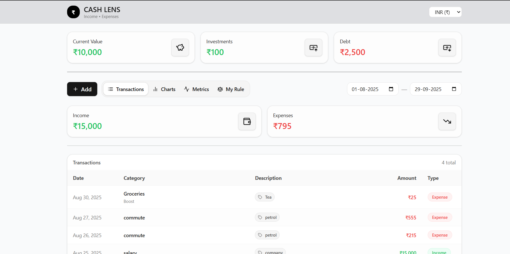
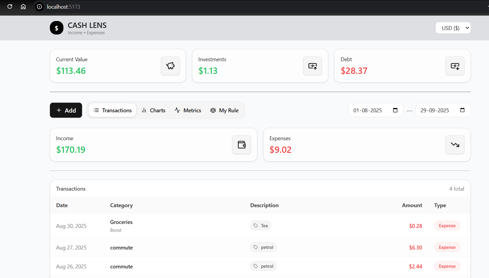
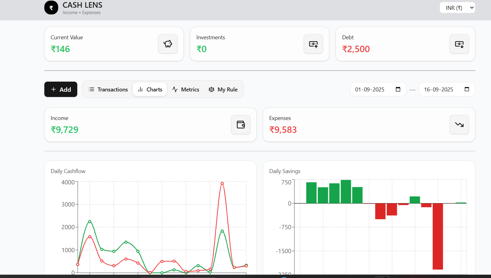

# CashLens 💸

_A smarter way to track wealth, debt, and financial health._

CashLens is a personal finance dashboard that helps you visualize your **net worth**, **investments**, **debts**, and other financial metrics in real-time. Built with **Django (backend)** and **React (frontend)**, it’s designed for clarity, speed, and extensibility.

---

## 🚀 Features

- 📊 **Wealth & Debt Metrics**:

  - Net Worth = Current Value + Investments – Total Debt
  <!-- - Debt-to-Income Ratio = Total Debt / Total Income
  - Debt-to-Investment Ratio = Total Debt / Investments
  - Leverage Ratio = Total Assets / Equity -->

- 📈 **Dynamic Dashboard** with clean UI and analytics.
- 🐳 **Dockerized Setup** for easy deployment.
- ⚡ **API-first design** for integration with external apps.

---

## 🛠️ Tech Stack

- **Backend**: Django + Django REST Framework
- **Frontend**: React (with Tailwind CSS & ShadCN UI)
- **Database**: SQLITE (default, configurable)
- **Containerization**: Docker & Docker Compose

---

## 📂 Project Structure

```
cashlens/
│── backend/            # Django backend (APIs, models)
│── frontend/           # React frontend (dashboard UI)
│── docker-compose.yml  # Multi-service orchestration
│── README.md           # You are here
```

---

## ⚡ Getting Started

### 1. Clone the repo

```bash
git clone https://github.com/your-username/cashlens.git
cd cashlens
```

### 2. Run with Docker

```bash
docker-compose up --build -d
```

By default:

- Frontend runs on **http://localhost:8989**

### 3. Without Docker (manual)

Backend:

```bash
cd backend
pip install -r requirements.txt
python manage.py migrate
python manage.py runserver
```

Frontend:

```bash
cd frontend
npm install
npm start
```

---

## 📖 Usage

1. Open the browser with port 8989
2. Enter your **current value, investments, debts, and income**.
3. View your metrics in real-time on the dashboard.

---

## 📸 Screenshots

Dashboard Overview:  




Wealth Metrics Card:  


---

## 🤝 Contributing

Contributions are welcome!

- Fork the repo
- Create a feature branch
- Submit a PR 🚀

---

## 📜 License

MIT License © 2025 [Dinesh](https://github.com/dineshreddypaidi)
